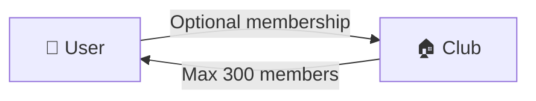
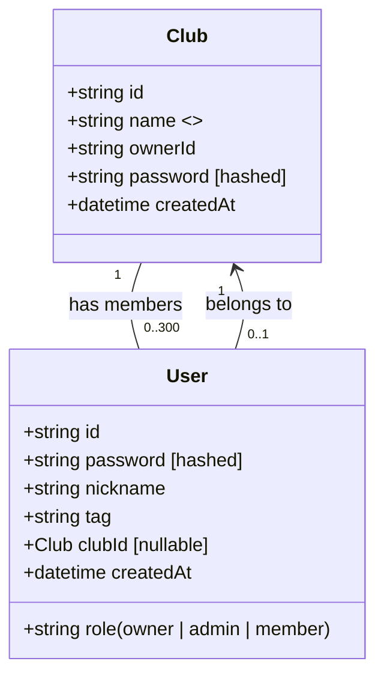

# 클럽 및 유저 아키텍처 문서
이 문서는 클럽(Club)과 유저(User)의 관계를 정의하고, 데이터 구조 및 관계를 시각적으로 설명합니다.

또한, 클럽 생성 및 가입에 대한 주요 규칙을 포함하며, 추후 확장성을 고려한 설계를 기반으로 합니다.

## 📌 1. 개요
클럽(Club)은 유저(User)들이 속할 수 있는 단위이며, 한 클럽당 최대 300명의 멤버를 가질 수 있습니다.

유저는 클럽에 속하지 않을 수도 있으며, 추후 클럽 검색 및 가입 기능을 통해 참여할 수 있습니다.

아래 다이어그램은 클럽과 유저의 관계를 간략히 나타낸 것입니다.



- 유저는 클럽에 속할 수도 있고, 속하지 않을 수도 있음
- 클럽 내 유저는 최대 300명까지 제한됨

## 📌 2. 데이터 구조
클럽과 유저의 주요 속성을 정의하고, 관계를 나타낸 클래스 다이어그램입니다.



### 📌 2.1 클럽 (Club) 엔티티
클럽은 유니크한 이름을 가지고 있으며, 소모임장(오너) 계정에 의해 생성됩니다.

한 클럽에는 최대 300명의 유저가 포함될 수 있으며, 해산할 수 없습니다.

✅ 필드 설명

| 필드명 | 타입               | 설명                |
| --- |------------------|-------------------|
| id | string           | 클럽의 고유 식별자 (UID)  |
| name | string (unique)  | 클럽 이름 (중복 불가)     |
| ownerId | string           | 클럽을 생성한 오너 유저 ID  |
| password | string (hashed)  | 클럽 생성 시 입력하는 비밀번호 |
| createdAt | datetime         | 클럽 생성 일시          |


✅ 주요 규칙
- 클럽의 이름(name)은 유니크해야 함
- 클럽 생성자는 자동으로 owner 역할을 가짐
- 클럽 해산은 불가능하며, 운영 정책상 삭제할 수 없음
- 클럽 내 멤버 수는 최대 300명으로 제한됨

### 📌 2.2 유저 (User) 엔티티
유저는 클럽에 가입할 수도 있고, 가입하지 않을 수도 있습니다.

회원가입 시 닉네임과 태그(nickname#tag)를 사용하여 유저를 식별합니다.

✅ 필드 설명

| 필드명 | 타입                 | 설명                |
| --- |--------------------|-------------------|
| id | string             | 유저의 고유 식별자       |
| password | string (hashed)   | 로그인 비밀번호         |
| nickname | string            | 유저 닉네임           |
| tag | string              | 닉네임과 조합된 해시값 (ex: 닉네임#1234) |
| clubId | Club (nullable)    | 가입한 클럽 ID (없을 수도 있음) |
| role | string             | 유저의 역할 (owner, admin, member) |
| createdAt | datetime          | 가입일               |

✅ 주요 규칙
- 닉네임과 태그는 필수 입력 항목
- 유저는 클럽 없이 존재할 수도 있음 (가입 후 클럽 탐색 가능)
- 유저는 본인의 역할(role)을 직접 선택할 수 없음
- 클럽 가입 시 기본값: member
- 클럽 생성 시 자동으로 owner 지정

## 📌 3. 클럽과 유저 관계
클럽과 유저의 관계를 설명하는 주요 규칙들입니다.

✅ 3.1 관계 정의
1. 클럽(Club)
   - 한 클럽은 최대 300명의 유저를 가질 수 있음
   - 클럽 생성 시 자동으로 소유자(owner) 지정됨
2. 유저(User)
   - 유저는 클럽에 속할 수도, 속하지 않을 수도 있음
   - 클럽 가입 시 기본적으로 member 역할 부여
   - 클럽 소속 유저는 클럽 UID를 입력하여 가입 가능
   
## 📌 4. 확장 고려 사항
현재 아키텍처는 기본적인 기능을 정의하며, 추후 확장을 고려한 구조입니다.

| 기능            | 현재 상태       | 확장 가능 여부     |
|--------------|--------------|-----------------|
| 클럽 해산       | ❌ (불가능)    | 추후 정책에 따라 결정 |
| 멤버 승인 기능   | ❌ (미구현)    | 관리자 승인 방식 추가 가능 |
| 클럽 검색 및 가입 | ❌ (미구현)    | 커뮤니티 검색 기능 확장 가능 |
| 초대 코드 기능   | ❌ (미구현)    | 클럽 UID 대신 초대 코드 방식 도입 가능 |

## 📌 5. 관련 문서 구조
프로젝트에서 문서화를 진행할 때, 아래와 같은 구조로 분리하면 관리가 용이합니다.

📂 docs/ 디렉토리 구조
```plaintext
/docs
│── README.md         # 문서 개요
│── architecture.md   # 전체 아키텍처 설명
│── club.md           # 클럽 구조 및 API 설계
│── user.md           # 유저 구조 및 API 설계
│── database.md       # 데이터 모델링 및 관계 정리
│── auth.md           # 인증 및 권한 관리
│── future.md         # 확장 기능 및 고려 사항
```
- 📜 README.md → 문서 개요
- 📜 architecture.md → Mermaid 다이어그램 포함한 전체 구조
- 📜 club.md → 클럽 엔티티 및 API 상세 설명
- 📜 user.md → 유저 엔티티 및 가입/로그인 규칙
- 📜 database.md → DB 테이블 스키마 및 관계 정리
- 📜 auth.md → 인증 방식 (JWT 등) 및 권한 관리
- 📜 future.md → 확장 가능한 기능 목록 정리
