# 🧭 경매 시스템 흐름 정리

경매는 관리자에 의해 시작되며, 팀원 중 한 명을 매물로 선정하여 입찰을 진행하고,

최고가 입찰자 기준으로 낙찰을 확정하는 순환 구조입니다.  

이 문서는 전체 경매 프로세스 흐름과 관련 소켓 이벤트, 상태 저장 위치 등을 정리합니다.

---

## 📌 전체 흐름 다이어그램

```mermaid
sequenceDiagram
  participant Admin
  participant Client
  participant SocketServer
  participant Redis
  participant MongoDB

  %% 경매 유저 선택
  Admin->>SocketServer: auction:next-user
  SocketServer->>MongoDB: 남은 유저 목록 조회 (캡틴 제외)
  MongoDB-->>SocketServer: 유저 목록
  SocketServer->>Redis: 현재 매물 유저 및 라운드 상태 업데이트 (HSET)
  SocketServer->>Client: auction:show-user (선택된 유저)

  %% 입찰 시작 및 타이머
  Admin->>SocketServer: auction:start-bid
  SocketServer->>Redis: 경매 타이머 시작 (TTL 설정 또는 Pub/Sub 이벤트)
  SocketServer->>Client: auction:start-bid (10초 타이머 시작)

  %% 입찰 처리
  Client->>SocketServer: auction:input (입찰 포인트)
  SocketServer->>Redis: 입찰 내역 저장 (ZADD to ZSET: Score=Point)
  SocketServer->>Client: auction:selected (현재 최고 입찰 내역 broadcast)

  %% 타이머 종료 및 결과 계산
  Redis-->>SocketServer: 10초 타이머 만료 알림
  SocketServer->>Redis: ZSET에서 최고가 계산 (ZREVRANGE)
  SocketServer->>Client: auction:timeout (최고 입찰자 및 유찰 여부)

  %% 낙찰 확정
  Admin->>SocketServer: auction:finalize (낙찰 확정 or 유찰)
  SocketServer->>MongoDB: 낙찰 결과 저장 (AuctionUser.users 및 captainPoints 업데이트)
  SocketServer->>Redis: 실시간 상태 초기화 및 잔여 포인트 업데이트 (HSET)
  SocketServer->>Client: auction:finalized (낙찰 결과)
```



## 🧩 저장소별 역할 정리

| 데이터 | 저장 위치 | 설명 |
|:---|:---|:---|
| 전체 유저 목록 | MongoDB (AuctionUser) | 최초 경매 시작 시 조회 |
| 남은 유저 / 매물 유저 | 서버 메모리 (Map) | 소켓 서버에서 관리 |
| 입찰 내역 | 서버 메모리 (captainBids[]) | 10초 동안 수집 |
| 낙찰 결과 | 서버 메모리 (captainPoints) &rarr; MongoDB (AuctionUser.users) | 관리자 확정 시 서버 메모리 업데이트 후 DB에 반영 (별도 서비스/로직) |

## 🧱 서버 메모리 상태 구조 예시

```typescript
type AuctionState = {
  currentTarget: AuctionUserData | null; // 현재 경매 중인 대상 유저
  captainBids: { // 각 팀장이 입찰한 내역 (nickname, point, teamId)
    nickname: string;
    point: number;
    teamId: string;
  }[];
  selectedUsers: AuctionUserData[]; // 지금까지 경매에 등장했던 유저 목록 (중복 X)
  round: number; // 현재 라운드 수 (1부터 시작)
  isFinished: boolean; // 경매가 종료되었는지 여부
  captainPoints: { [nickname: string]: number; }; // 각 팀장별 남은 포인트 (초기값 1000)
  isReady: boolean; // 경매 준비 완료 여부
  isBidding: boolean; // 경매 시작 여부
  timerId?: NodeJS.Timeout; // 경매 타이머 ID
  endAt?: number; // 경매 종료 시간
};

const auctionStateMap = new Map<string, AuctionState>();
```

## 🔌 소켓 이벤트 흐름

| 이벤트 | 방향 | 설명 |
|:---|:---|:---|
|auction:next-user|Admin → Server|매물 유저 요청|
|auction:show-user|Server → All|선택된 유저 브로드캐스트|
|auction:start-bid|Admin → Server|입찰 시작 신호 및 10초 타이머 시작|
|auction:input|Captain → Server|입찰 포인트 전송|
|auction:selected|Server → All|현재까지의 입찰 내역 브로드캐스트|
|auction:timeout|Server → All|입찰 타이머 종료 시 최고 입찰자 및 유찰 여부 안내|
|auction:finalize|Admin → Server|낙찰 확정 or 유찰 결정|
|auction:finalized|Server → All|낙찰 최종 결과 브로드캐스트|

## ⚙️ 경매 세부 규칙
- 경매 타이머: **10초 (상수로 관리)**
- 입찰 타이머는 새로운 경매 유저 선택 또는 경매 시작 시 10초로 초기화됩니다.
- 입찰: **숫자만 허용**, **10/100 단위 증감 UI** 제공 (클라이언트에서 처리)
- 유저 기본 포인트: **1000 포인트 (상수로 정의)**
- 유찰된 유저는 다시 포인트 부여 후 재경매 대상 (확장 고려 사항)

## 🧠 확장 고려 사항
- 포인트 수정 기능 (미사용 중, 확장성만 고려)
- 낙찰자/유찰자 목록 시각화
- 경매 로그 기록 기능
- 서버 재시작 시 상태 복구 (필요 시 Redis 등 도입)
- 유찰 시 유저 재경매 대상 처리 (현재 미구현)
