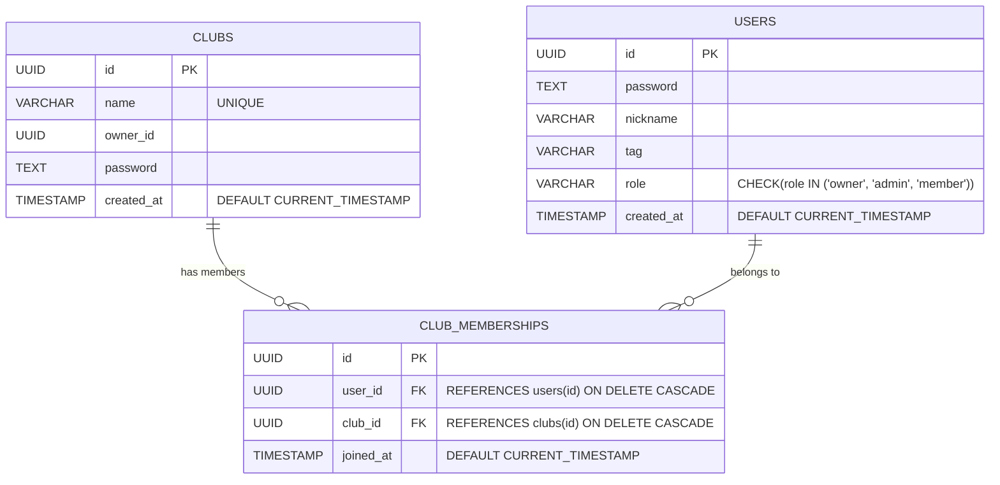

# 📌 데이터베이스 설계 (database.md)
이 문서는 클럽 및 유저 관련 데이터베이스 스키마와 관계를 설명합니다.
데이터 정합성을 유지하기 위해 유니크 제약, 외래 키, 인덱스 최적화 등을 고려한 설계를 포함합니다.

## 📌 1. 테이블 개요
클럽과 유저는 아래와 같은 테이블을 기반으로 관리됩니다.

| 테이블명         | 설명          |
|-----------------|--------------|
| clubs           | 클럽(소모임) 정보 저장 |
| users           | 유저(회원) 정보 저장 |
| club_memberships | 클럽과 유저의 관계 (가입 여부 관리) |

## 📌 2. 테이블 스키마 정의
아래는 클럽과 유저 테이블의 상세 스키마입니다.

### ✅ 2.1 clubs 테이블
클럽 정보 저장

```sql
CREATE TABLE clubs (
  id         UUID PRIMARY KEY,  -- 클럽 고유 ID
  name       VARCHAR(255) UNIQUE NOT NULL,  -- 클럽 이름 (유니크)
  owner_id   UUID NOT NULL,  -- 클럽 오너 (유저 ID 참조)
  password   TEXT NOT NULL,  -- 클럽 생성 비밀번호 (해시 저장)
  created_at TIMESTAMP DEFAULT CURRENT_TIMESTAMP -- 클럽 생성 일시
);
```
🔹 주요 제약 사항
- name → 유니크 (UNIQUE) 설정 (중복 불가)
- owner_id → 외래 키 (users.id) 참조 가능 (하지만 강제하지 않음)
- password → 암호화 저장 필수 (해싱 적용)
- created_at → 자동 생성 (CURRENT_TIMESTAMP)

### ✅ 2.2 users 테이블
유저 정보 저장

```sql
CREATE TABLE users (
  id         UUID PRIMARY KEY,  -- 유저 고유 ID
  password   TEXT NOT NULL,  -- 로그인 비밀번호 (해시 저장)
  nickname   VARCHAR(50) NOT NULL,  -- 닉네임
  tag        VARCHAR(10) NOT NULL,  -- 해시태그 (닉네임과 조합)
  role       VARCHAR(10) CHECK (role IN ('owner', 'admin', 'member')),  -- 유저 역할
  created_at TIMESTAMP DEFAULT CURRENT_TIMESTAMP -- 가입일시
);
```
🔹 주요 제약 사항
- nickname + tag → 조합하여 유니크하게 사용 가능
- password → 보안 강화를 위해 해싱 적용 필수
- role → 사전에 정해진 값만 허용 (CHECK 제약 적용)
- created_at → 자동 생성 (CURRENT_TIMESTAMP)

### ✅ 2.3 club_memberships 테이블
클럽과 유저 관계 관리

유저가 클럽에 속하는 정보를 저장하는 연결 테이블 (M:N 관계 대응)

```sql
CREATE TABLE club_memberships (
  id         UUID PRIMARY KEY,  -- 관계 ID
  user_id    UUID NOT NULL REFERENCES users(id) ON DELETE CASCADE,  -- 유저 ID
  club_id    UUID NOT NULL REFERENCES clubs(id) ON DELETE CASCADE,  -- 클럽 ID
  joined_at  TIMESTAMP DEFAULT CURRENT_TIMESTAMP -- 가입 일시
);
```

🔹 주요 제약 사항
- user_id, club_id → 외래 키(users, clubs)를 참조
- ON DELETE CASCADE 설정 →
- 클럽이 삭제되면 해당 클럽에 속한 멤버십도 삭제됨
- 유저가 삭제되면 해당 유저의 가입 정보도 삭제됨
- joined_at → 가입 일시 자동 생성

## 📌 3. 관계 및 인덱스 최적화
각 테이블 간의 관계와 인덱스 최적화를 고려한 설계입니다.

## ✅ 3.1 테이블 관계 다이어그램


### ✅ 3.2 인덱스 설정
데이터 검색 최적화를 위해 추가적인 인덱스를 설정합니다.

```sql
-- 클럽 검색 최적화
CREATE INDEX idx_clubs_name ON clubs(name);

-- 유저 검색 최적화 (닉네임 + 태그 조합)
CREATE INDEX idx_users_nickname_tag ON users(nickname, tag);

-- 클럽 멤버십 검색 최적화 (유저가 속한 클럽 빠르게 조회)
CREATE INDEX idx_club_memberships_user ON club_memberships(user_id);

-- 클럽 멤버십 검색 최적화 (클럽 내 멤버 빠르게 조회)
CREATE INDEX idx_club_memberships_club ON club_memberships(club_id);
```

## 📌 4. 데이터베이스 제약 조건
클럽 및 유저 관련 데이터 정합성을 유지하기 위해 제약 조건을 적용합니다.

| 제약 조건       | 대상 테이블         | 설명               |
|---------------|-------------------|------------------|
| PRIMARY KEY   | clubs, users, club_memberships | 각 테이블의 고유 식별자를 설정 |
| UNIQUE        | clubs.name        | 클럽 이름은 중복될 수 없음 |
| CHECK         | users.role        | role 값은 특정 값만 허용 |
| FOREIGN KEY   | club_memberships  | users 및 clubs 테이블을 참조 |
| ON DELETE CASCADE | club_memberships | 클럽 또는 유저 삭제 시 연관된 데이터 삭제 |

## 📌 5. 확장 고려 사항
현재 데이터 모델은 기본적인 클럽 및 유저 관리 기능을 충족하며, 확장을 고려하여 설계되었습니다.

| 기능	| 현재 상태	| 확장 가능 여부 |
|-------|-----------|---------------|
| 클럽 해산	| ❌ (불가능)	| 운영 정책 변경 시 추가 가능 |
| 클럽 멤버 승인	| ❌ (미구현)	| 관리자가 승인하는 기능 추가 가능 |
| 클럽 검색 기능	| ❌ (미구현)	| 검색 최적화를 위한 인덱스 추가 가능 |
| 초대 코드 방식 가입	| ❌ (미구현)	| 클럽 UID 대신 초대 코드 도입 가능 |

