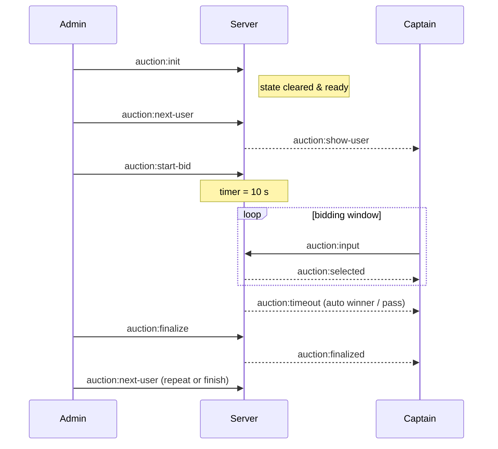
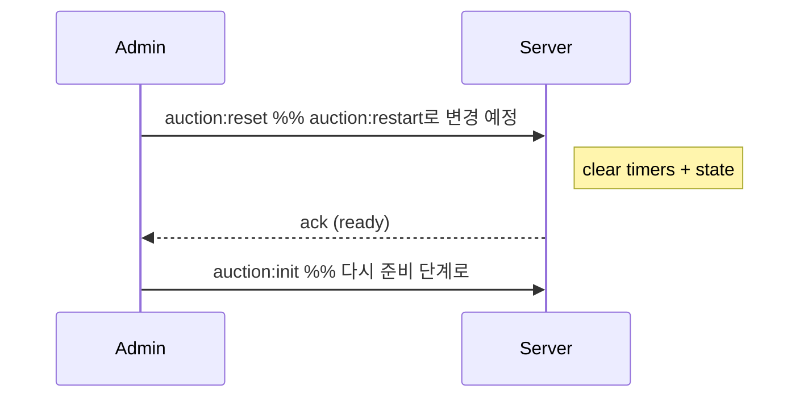

# Auction Socket – Progress & To-Do
_Last updated: 2025-05-01_

---

## 1. Current implementation (✅ = done)

| Status | Handler | Purpose |
|:---:|---|---|
| ✅ | **`handleInitAuction`** | `auction:init` — **대기 중** 방을 초기화해 “경매 준비 완료” 상태로 만듦 |
| ✅ | **`handleNextUser`** | 랜덤 남은 유저 → `auction:show-user` |
| ✅ | **`handleInputBid`** | 팀장 입찰 입력 → `auction:selected` (포인트 차감은 `handleFinalizeAuction`에서 이루어짐) |
| [ ] | **`handleFinalizeAuction`** | 관리자 낙찰 확정, 포인트 차감 (DB 영구 저장 및 유찰 처리는 추가 확인/구현 필요) |
| ✅ | 기본 채팅 |

---

## 2. Missing features / To-Do

| Status | Task | Notes |
|:---:|---|---|
| ✅ | **`handleStartBid`** (`auction:start-bid`) | 10 s 타이머 시작 |
| ✅ | **타이머 유틸** (`timerId`, `endAt`, `isBidding`) | reset & countdown broadcast |
| ✅ | **Timeout handler** | 최고가 입찰자 안내 (무입찰 시 유찰 처리 로직 추가 필요) |
| [ ] | **`handlePassAuction`** (`auction:pass`) | 관리자가 유찰 선언 (현재 구현되지 않음) |
| [ ] | **Restart flow** : **`handleRestartAuction`** (`auction:restart`) | *현재 모든 상태* (타겟·입찰·타이머) 초기화 후 다시 `auction:init` 단계로 복귀 |
| ✅ | **Broadcast `auction:tick`** | 클라이언트 남은 시간 UI |
| ⬜ | **클라이언트: 경매 준비 vs 재시작** | UI — “준비(Init)” 버튼, “재시작(Restart)” 버튼 분리 |
| [ ] | DB persist & room clean-up | 낙찰 결과 DB 영구 저장 로직 구현 및 Redis 도입 고려 |

> `reset` → **rename 예정** → `restart` (기존 reset 로직 = 모든 state 리셋)

---

## 3. Expanded `auctionStateMap`

```ts
interface AuctionState {
    // existing …
    isReady: boolean;         // auction:init 완료 여부
    timerId?: NodeJS.Timeout; // live timer
    endAt?: number;           // epoch ms
    isBidding: boolean;       // true ↔ 10 s window
    currentTarget: AuctionUserData | null; // 현재 경매 중인 대상 유저
    captainBids: { // 각 팀장이 입찰한 내역 (nickname, point, teamId)
        nickname: string;
        point: number;
        teamId: string;
    }[];
    selectedUsers: AuctionUserData[]; // 지금까지 경매에 등장했던 유저 목록 (중복 X)
    round: number; // 현재 라운드 수 (1부터 시작)
    isFinished: boolean; // 경매가 종료되었는지 여부
    captainPoints: { [nickname: string]: number; }; // 각 팀장별 남은 포인트 (초기값 1000)
}
```

## 4. Sequence overview

- 관리자가 먼저 `auction:init`을 눌러 방을 **준비 완료** 상태로 만든 뒤,
- `auction:next-user` 를 호출해 경매 대상 **유저를 랜덤**으로 뽑는다
- 서버는 뽑힌 유저 정보를 `auction:show-user` 이벤트로 모든 **참가자(팀장)에게 뿌린다**
- 대상을 확인한 뒤 관리자가 `auction:start-bid` 버튼을 누르면 서버가 10초 **타이머를 켜고** 입찰을 받을 준비를 한다
- **타이머가 돌아가는 동안** 팀장들은 `auction:input` 이벤트로 **포인트를 제시**할 수 있으며, 최신 입찰 내역을 `auction:selected`로 실시간 브로드캐스트한다.
- 10초가 지나 더 이상 **입력이 없으면 서버가 자동으로 타임-아웃**을 처리한다 (`auction:timeout` 발생).
- 입찰이 하나라도 있으면 최고가 팀장이 잠정 낙찰자로, 아무도 입찰하지 않았으면 ‘유찰’ 상태로 결과가 정해진다.
- 이후 관리자가 화면에서 **낙찰을 확정**(`auction:finalize`)하거나 **유찰**(`auction:finalize` 시 별도 처리)을 결정하면
- 서버는 `auction:finalized` 이벤트로 모든 **클라이언트에 확정 결과를 알린다**
- 마지막으로 관리자가 다시 `auction:next-user`를 호출해 **다음 유저로 넘어가고**
- 위 절차를 유저가 소진될 때까지 반복한다

### 4‑1. 기본 흐름 (Init → Bidding)


### 4‑2. 재시작 흐름

## 5. Quick commit checklist

- [ ] feat(backend): add auction:restart handler to clear state
- [x] feat(backend): implement start-bid timer & timeout broadcast
- [ ] refactor(backend): rename reset logic to restart
- [ ] feat(frontend): separate Init vs Restart buttons & timer UI
- [x] chore: cleanup timers on restart/room close
